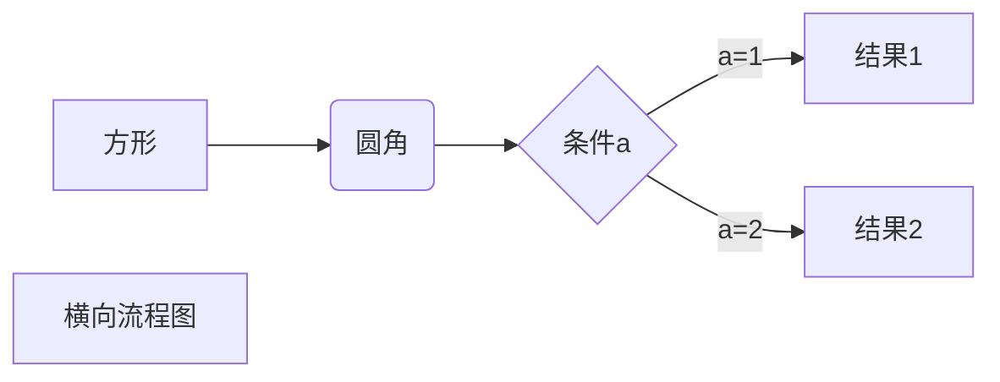
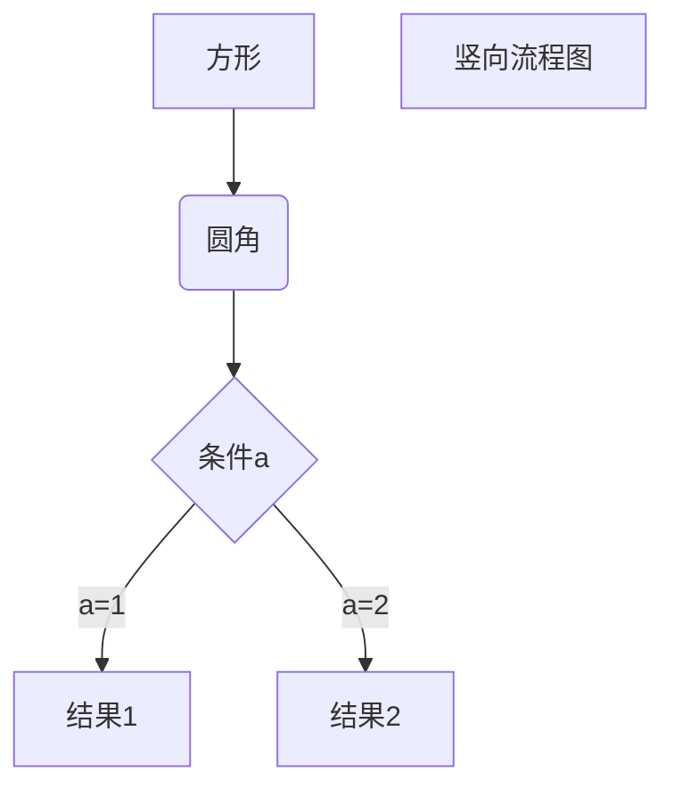
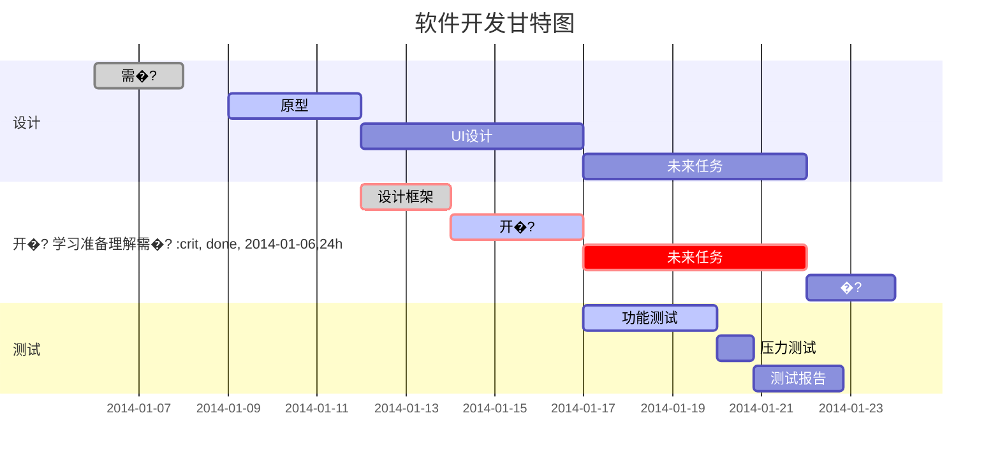

# Markdown学习

> Markdown是一种轻量级标记语言

[Basic Syntax | Markdown Guide](https://www.markdownguide.org/basic-syntax/)

我展示的是一级标�?==

我是二级标题
--

```markdown
我展示的是一级标�?==
我是二级标题
--
```


[toc]
- [Markdown学习](#markdown学习)
- [我展示的是一级标题](#我展示的是一级标�?
  - [我是二级标题](#我是二级标题)
- [一级标题](#一级标�?
  - [二级标题](#二级标题)
    - [三级标题](#三级标题)
      - [四级标题](#四级标题)
        - [五级标题](#五级标题)
          - [六级标题](#六级标题)
- [段落](#段落)
- [分割](#分割)
- [划掉](#划掉)
- [下划线](#下划�?
- [注脚](#注脚)
- [列表](#列表)
- [区块](#区块)
- [代码](#代码)
- [链接](#链接)
- [图片](#图片)
- [表格](#表格)
- [高级技巧](#高级技�?
- [画流程图、时序图(顺序�?、甘特图](#画流程图时序图顺序图甘特�?

```markdown
[toc] //github不认
Create Table of Contents  //在vscode中打开Command Palette（终端命令面板）后输�?```


# 一级标�?
## 二级标题
### 三级标题
#### 四级标题
##### 五级标题
###### 六级标题

```markdown
# 一级标�?## 二级标题
### 三级标题
#### 四级标题
##### 五级标题
###### 六级标题
```


# 段落
段落一  
段落�? 

*斜体文本*

```markdown
*斜体文本*
```

_斜体文本_

```markdown
_斜体文本_
```

**粗体文本**

```markdown
**粗体文本**
```

__粗体文本__

```markdown
__粗体文本__
```

***粗斜体文�?**

```markdown
***粗斜体文�?**
```

___粗斜体文本___

```markdown
___粗斜体文本___
```


# 分割

***
* * *
*****
- - -
---------------

```markdown
***
* * *
*****
- - -
---------------
```


# 划掉

RUNOOB.COM
GOOGLE.COM
~~BAIDU.COM~~

```markdown
RUNOOB.COM
GOOGLE.COM
~~BAIDU.COM~~
```


# 下划�?
<u>下划�?/u>

```markdown
<u>下划�?/u>
```


# 注脚
创建脚注格式类似这样 [^RUNOOB]�?
[^RUNOOB]: 菜鸟教程 -- 学的不仅是技术，更是梦想！！�?
```markdown
创建脚注格式类似这样 [^RUNOOB]�?
[^RUNOOB]: 菜鸟教程 -- 学的不仅是技术，更是梦想！！�?```


# 列表

* 第一�?* 第二�?* 第三�?
```markdown
* 第一�?* 第二�?* 第三�?```


+ 第一�?+ 第二�?+ 第三�?
```markdown
+ 第一�?+ 第二�?+ 第三�?```


- 第一�?- 第二�?- 第三�?
```markdown
- 第一�?- 第二�?- 第三�?```


1. 第一�?2. 第二�?3. 第三�?
```markdown
1. 第一�?2. 第二�?3. 第三�?```


+ AAAA
    - aaaa
    - bbbb
+ BBBB
    - bbbb
    - cccc

```markdown
+ AAAA
    - aaaa
    - bbbb
+ BBBB
    - bbbb
    - cccc
```


# 区块

> 区块引用
> 菜鸟教程
> 学的不仅是技术更是梦�?
```markdown
> 区块引用
> 菜鸟教程
> 学的不仅是技术更是梦�?```


> 最外层
>
> > 第一层嵌�?> >
> > > 第二层嵌�?```markdown
> 最外层
>
> > 第一层嵌�?> >
> > > 第二层嵌�?```


> 区块中使用列�?> 1. 第一�?> 2. 第二�?> + 第一�?> + 第二�?> + 第三�?```markdown
> 区块中使用列�?> 1. 第一�?> 2. 第二�?> + 第一�?> + 第二�?> + 第三�?```


* 第一�?    > 菜鸟教程
    > 学的不仅是技术更是梦�?* 第二�?```markdown
* 第一�?    > 菜鸟教程
    > 学的不仅是技术更是梦�?* 第二�?```


# 代码
`printf()`函数，行内代�?
```markdown
`printf()`
```


代码区块使用 4 个空格或者一个制表符（Tab 键）

```markdown
<?php
echo 'RUNOOB'
function test(){
 echo 'test'
}
```


```markdown
$(document).ready(function () {
    alert('RUNOOB');
});
```

````markdown
```markdown
$(document).ready(function () {
    alert('RUNOOB');
});
```
````


# 链接

这是一个链�?[百度](https://www.baidu.com)

```markdown
[百度](https://www.baidu.com)
```

<https://www.baidu.com>

```markdown
<https://www.baidu.com>
```

链接也可以用变量来代替，文档末尾附带变量地址�?这个链接�?1 作为网址变量 [Google][1]

```markdown
[Google][1]
```

这个链接�?runoob 作为网址变量 [Runoob][runoob]

```markdown
[Runoob][runoob]
```

然后在文档的结尾为变量赋值（网址�?
[1]: http://www.google.com/

```markdown
[1]: http://www.google.com/
```

[runoob]: http://www.runoob.com/

```markdown
[runoob]: http://www.runoob.com/
```


# 图片


```markdown


```

这个链接�?1 作为网址变量 [RUNOOB][1].

```markdown
[RUNOOB][1]
```

然后在文档的结尾为变量赋值（网址�?
[1]: http://static.runoob.com/images/runoob-logo.png

```markdown
[1]: http://static.runoob.com/images/runoob-logo.png
```


```markdown

```


# 表格
| ttt | ttt |
| --- | --- |
| ddd | ddd |
| ddd | ddd |

```markdown
| ttt | ttt |
| --- | --- |
| ddd | ddd |
| ddd | ddd |
```


| 表头 | 表头 |
| ---- | ---- |
| 单元�?| 单元�?|
| 单元�?| 单元�?|

```markdown
| 表头 | 表头 |
| ---- | ---- |
| 单元�?| 单元�?|
| 单元�?| 单元�?|
```


| 左对�?| 右对�?| 居中对齐 |
| :-| ----: | :----: |
| 单元�?| 单元�?| 单元�?|
| 单元�?| 单元�?| 单元�?|

```markdown
| 左对�?| 右对�?| 居中对齐 |
| :-| ----: | :----: |
| 单元�?| 单元�?| 单元�?|
| 单元�?| 单元�?| 单元�?|
```


# 高级技�?
支持�?HTML 元素
使用<kbd>Ctrl</kbd>+<kbd>Alt</kbd>+<kbd>Del</kbd>重启电脑

```markdown
<kbd>Ctrl</kbd>+<kbd>Alt</kbd>+<kbd>Del</kbd>
```

转义
**文本加粗** 

```markdown
**文本加粗**
```

\*\* 正常显示星号 \*\*

```markdown
\*\* 正常显示星号 \*\*
```

\\   反斜�?
```markdown
\\   反斜�?```

\`   反引�?
```markdown
\`   反引�?```

\*   星号

```markdown
\*   星号
```

\_   下划�?
```markdown
\_   下划�?```

\{\}  花括�?
```markdown
\{\}  花括�?```

\[\]  方括�?
```markdown
\[\]  方括�?```

\(\)  小括�?
```markdown
\(\)  小括�?```

\#   井字�?
```markdown
\#   井字�?```

\+   加号

```markdown
\+   加号
```

\-   减号

```markdown
\-   减号
```

\.   英文句点

```markdown
\.   英文句点
```

\!   感叹�?
```markdown
\!   感叹�?```

公式
	 $$ 包裹 TeX �?LaTeX 格式的数学公式来实现
�? 根据需要加�?Mathjax 对数学公式进行渲�?$$
\mathbf{V}_1 \times \mathbf{V}_2 =  \begin{vmatrix} 
\mathbf{i} & \mathbf{j} & \mathbf{k} \\
\frac{\partial X}{\partial u} &  \frac{\partial Y}{\partial u} & 0 \\
\frac{\partial X}{\partial v} &  \frac{\partial Y}{\partial v} & 0 \\
\end{vmatrix}
${$tep1}{\style{visibility:hidden}{(x+1)(x+1)}}
$$

```markdown
$$
\mathbf{V}_1 \times \mathbf{V}_2 =  \begin{vmatrix} 
\mathbf{i} & \mathbf{j} & \mathbf{k} \\
\frac{\partial X}{\partial u} &  \frac{\partial Y}{\partial u} & 0 \\
\frac{\partial X}{\partial v} &  \frac{\partial Y}{\partial v} & 0 \\
\end{vmatrix}
${$tep1}{\style{visibility:hidden}{(x+1)(x+1)}}
$$
```


# 画流程图、时序图(顺序�?、甘特图

具体语法可参考：[Mermaid | Diagramming and charting tool](https://mermaid.js.org/)

1、横向流程图源码格式�?

````markdown

````

2、竖向流程图源码格式�?

````markdown

````

3、标准流程图源码格式�?
```flow
st=>start: 开始框
op=>operation: 处理�?cond=>condition: 判断�?是或�?)
sub1=>subroutine: 子流�?io=>inputoutput: 输入输出�?e=>end: 结束�?st->op->cond
cond(yes)->io->e
cond(no)->sub1(right)->op
```
````markdown
```flow
st=>start: 开始框
op=>operation: 处理�?cond=>condition: 判断�?是或�?)
sub1=>subroutine: 子流�?io=>inputoutput: 输入输出�?e=>end: 结束�?st->op->cond
cond(yes)->io->e
cond(no)->sub1(right)->op
```
````

4、标准流程图源码格式（横向）�?
```flow
st=>start: 开始框
op=>operation: 处理�?cond=>condition: 判断�?是或�?)
sub1=>subroutine: 子流�?io=>inputoutput: 输入输出�?e=>end: 结束�?st(right)->op(right)->cond
cond(yes)->io(bottom)->e
cond(no)->sub1(right)->op
```
````markdown
```flow
st=>start: 开始框
op=>operation: 处理�?cond=>condition: 判断�?是或�?)
sub1=>subroutine: 子流�?io=>inputoutput: 输入输出�?e=>end: 结束�?st(right)->op(right)->cond
cond(yes)->io(bottom)->e
cond(no)->sub1(right)->op
```
````

5、UML时序图源码样例：

```sequence
对象A->对象B: 对象B你好�?（请求）
Note right of 对象B: 对象B的描�?Note left of 对象A: 对象A的描�?提示)
对象B-->对象A: 我很�?响应)
对象A->对象B: 你真的好吗？
```
````markdown
```sequence
对象A->对象B: 对象B你好�?（请求）
Note right of 对象B: 对象B的描�?Note left of 对象A: 对象A的描�?提示)
对象B-->对象A: 我很�?响应)
对象A->对象B: 你真的好吗？
```
````

6、UML时序图源码复杂样例：

```sequence
Title: 标题：复杂使�?对象A->对象B: 对象B你好�?（请求）
Note right of 对象B: 对象B的描�?Note left of 对象A: 对象A的描�?提示)
对象B-->对象A: 我很�?响应)
对象B->小三: 你好�?小三-->>对象A: 对象B找我�?对象A->对象B: 你真的好吗？
Note over 小三,对象B: 我们是朋�?participant C
Note right of C: 没人陪我�?```
````markdown
```sequence
Title: 标题：复杂使�?对象A->对象B: 对象B你好�?（请求）
Note right of 对象B: 对象B的描�?Note left of 对象A: 对象A的描�?提示)
对象B-->对象A: 我很�?响应)
对象B->小三: 你好�?小三-->>对象A: 对象B找我�?对象A->对象B: 你真的好吗？
Note over 小三,对象B: 我们是朋�?participant C
Note right of C: 没人陪我�?```
````

7、UML标准时序图样例：

```mermaid
%% 时序图例�?-> 直线�?->虚线�?>>实线箭头
  sequenceDiagram
    participant 张三
    participant 李四
    张三->王五: 王五你好吗？
    loop 健康检�?        王五->王五: 与疾病战�?    end
    Note right of 王五: 合理 食物 <br/>看医�?..
    李四-->>张三: 很好!
    王五->李四: 你怎么�?
    李四-->王五: 很好!
```
````markdown
```mermaid
%% 时序图例�?-> 直线�?->虚线�?>>实线箭头
  sequenceDiagram
    participant 张三
    participant 李四
    张三->王五: 王五你好吗？
    loop 健康检�?        王五->王五: 与疾病战�?    end
    Note right of 王五: 合理 食物 <br/>看医�?..
    李四-->>张三: 很好!
    王五->李四: 你怎么�?
    李四-->王五: 很好!
```
````

8、甘特图样例�?


```` markdown

````
